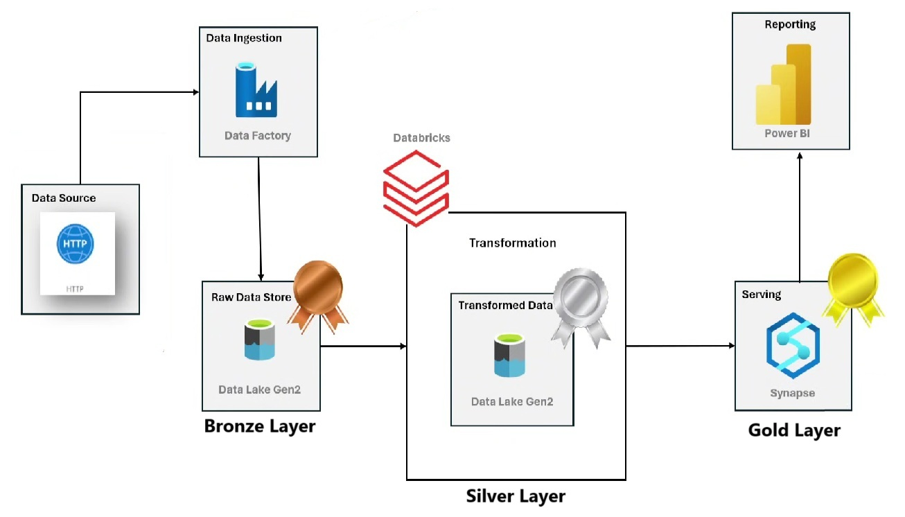

# Adventure Works Data Analytics | Data Engineering Azure Project

## Introduction
The "AW Data Engineering Project" focuses on designing and implementing a robust data processing and analytics pipeline using Azure services. This projecrt integrates Azure Data Factory for pipeline orchestration, Azure Databricks for data transformation, Azure Synapse Analytics for scalable data warehousing, and Power BI for insightful visualizations, delivering end-to-end data engineering solutions.

## Architecture

# Technology Used
1. Programing Language - Python
2. Scripting Language - SQL
3. Microsoft Azure Cloud
   - Azure Data Factory
   - Azure Databricks
   - Azure Synapse Analytics
4. Visualization Tool - Power BI

# Dataset Used
The Adventure Works dataset is a comprehensive database, contains data related to a fictional bikes and accessories manufacturing company, covering aspects like sales, products, customers, employees, and supply chain operations.

- Here is the dataset used in this project - [Project Dataset](https://github.com/Suranjan-Dey/AW-Data-Engineering-Project/tree/main/Dataset)
- Original Data Source - [Dataset](https://www.kaggle.com/datasets/ukveteran/adventure-works/data?select=AdventureWorks_Product_Categories.csv)

# Synapse Scripts for Project
1. [Create View File](SQL-Scripts/AW_Create_View.sql)
2. [Create Schema File](SQL-Scripts/Create_Schema.sql)
3. [SQL Script File](SQL-Scripts/SQL_Script.sql)
