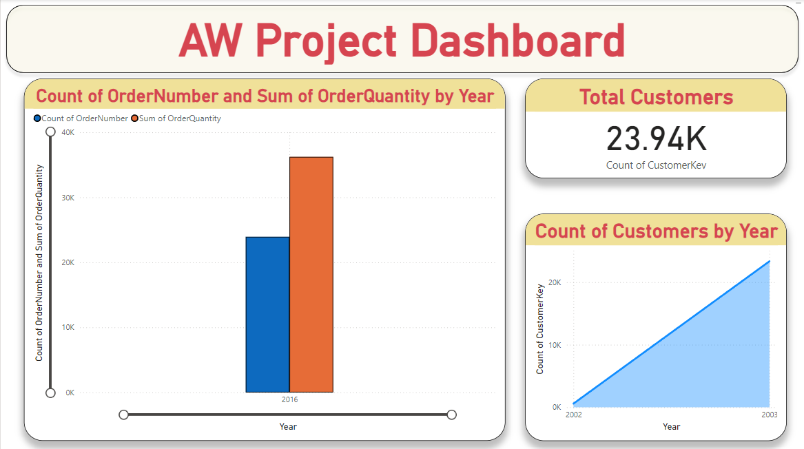

# Adventure Works Data Analytics | Data Engineering Project

## Introduction
The "AW Data Engineering Project" focuses on designing and implementing a robust data processing and analytics pipeline using Azure services. This project leverages Azure Data Lake Storage Gen2 for scalable storage and Azure Data Factory for orchestrating ETL pipelines in bronze layer. It incorporates Azure Databricks for data transformation and advanced analytics in silver layer, integrates Azure Synapse Analytics for efficient querying and data warehousing in gold layer, and utilizes Power BI for insightful data visualization and reporting, delivering end-to-end data engineering solutions.

## Architecture

# Technology Used
1. Programing Language - Python
2. Scripting Language - SQL
3. Microsoft Azure Cloud
   - Azure Data Lake Storage Gen2
   - Azure Data Factory
   - Azure Databricks
   - Azure Synapse Analytics
5. Visualization Tool - Power BI

# Dataset Used
The Adventure Works dataset is a comprehensive database, contains data related to a fictional bikes and accessories manufacturing company, covering aspects like sales, products, customers, employees, and supply chain operations.

- Here is the dataset used in this project - [Project Dataset](https://github.com/Suranjan-Dey/AW-Data-Engineering-Project/tree/main/Dataset)
- Original Data Source - [Dataset](https://www.kaggle.com/datasets/ukveteran/adventure-works)

# Azure Data Factory Pipeline
In the **AW Data Engineering Project**, data ingestion is performed from an HTTP source into Azure Data Lake Storage Gen2 using Azure Data Factory. The workflow in Azure Data Factory follows these steps:
- **Lookup Activity**: Retrieves a dataset from the specified HTTP source and extracts the content of a [configuration file](AW-Data-Engineering-Project/gitfile.json). This configuration file typically defines the parameters required for subsequent operations.
- **ForEach Activity**: Processes the output of the Lookup Activity, iterating over its elements to enable parallel or sequential execution of tasks.
- **Copy Activity:** Executes within the ForEach Activity to facilitate data transfer from the HTTP source to Azure Data Lake Storage Gen2. This activity ensures seamless ingestion and storage of data in a structured format.

# Databricks Script
In the **AW Data Engineering Project**, data transformation is conducted in the Silver Layer using Azure Databricks. Azure Databricks provides a highly scalable and collaborative environment for performing advanced data transformations, enabling the cleansing, enrichment, and standardization of raw data ingested from the Bronze Layer.This transformation process ensures that the data in the Silver Layer is optimized for further analytical and reporting purposes while maintaining consistency and accuracy.
- Click on below link to see Script:
1. [Data Tranformation in Silver Layer](AW-Data-Engineering-Project/AW_Databricks_Notebook.ipynb)

# Synapse Scripts
- Click on below links to see Script:
1. [Create Schema File](SQL-Scripts/Create_Schema.sql)
2. [Create View File](SQL-Scripts/AW_Create_View.sql)
3. [SQL Script for Gold Layer](SQL-Scripts/SQL_Script.sql)

# Data Visualization With Power BI

## Connect With Me: [LinkedIn](https://www.linkedin.com/in/suranjandey/)
